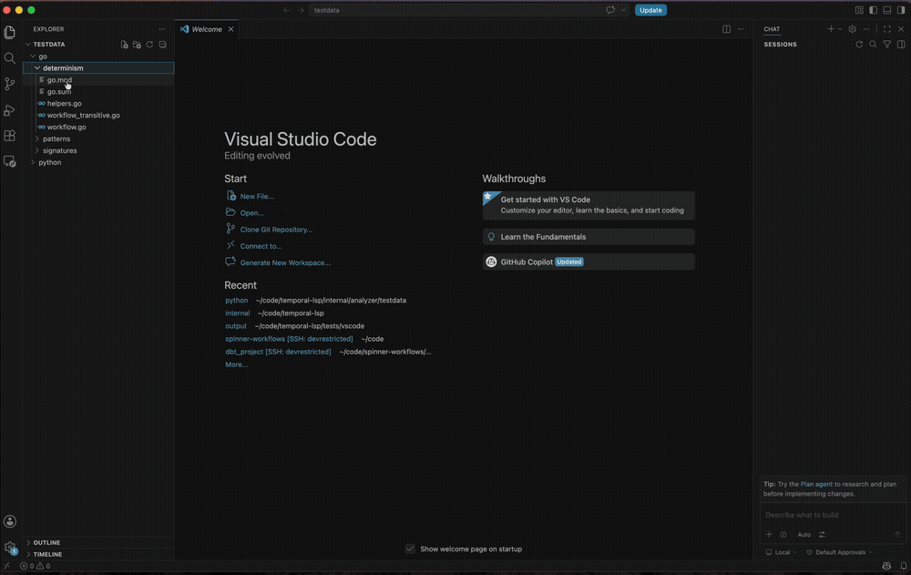
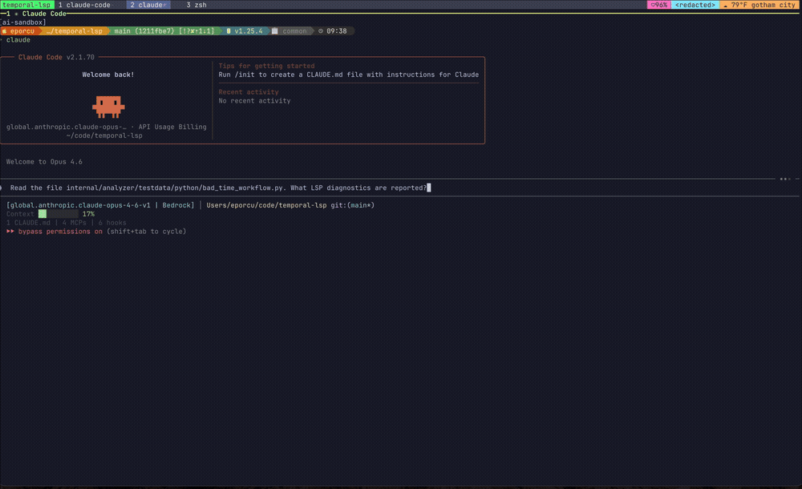

# temporal-lsp

A Language Server Protocol implementation that detects Temporal workflow
anti-patterns and best-practice violations.


## Acknowledgments

The rules in this LSP are inspired by
[100 Temporal Mistakes and How to Avoid Them](https://github.com/jlegrone/100-temporal-mistakes)
by [Jacob LeGrone](https://jacob.work), licensed under
[CC BY-NC 4.0](https://creativecommons.org/licenses/by-nc/4.0/).

Go determinism detection is powered by
[workflowcheck](https://pkg.go.dev/go.temporal.io/sdk/contrib/tools/workflowcheck),
built by the Temporal team. It performs transitive analysis of function call graphs
to catch non-determinism that simpler pattern matching would miss.

## Installation

```bash
go install github.com/edmondop/temporal-lsp/cmd/temporal-lsp@latest
```

## Editor & Agent Support

### VS Code

Extension with inline diagnostics and Problems panel. [Setup guide](docs/vscode.md)



### Claude Code

LSP plugin with automatic diagnostics on file read/edit. [Setup guide](docs/claude-code.md)



### Neovim

Via `nvim-lspconfig` custom server. [Setup guide](docs/neovim.md)

## Rules

### Determinism (Tier 1)

These detect non-deterministic operations inside workflow code:

| Rule ID | Description |
|---------|-------------|
| `temporal/no-time-now` | Use workflow time APIs instead of `time.Now()` / `datetime.now()` / `System.currentTimeMillis()` / `SystemTime::now()` |
| `temporal/no-sleep` | Use workflow sleep instead of `time.Sleep()` / `time.sleep()` / `Thread.sleep()` / `thread::sleep()` |
| `temporal/no-random` | Use workflow randomness instead of `math/rand` / `random.*` / `Math.random()` / `rand::*` |
| `temporal/no-io` | Move network/IO calls to activities |
| `temporal/no-goroutine` | Use workflow-managed concurrency instead of raw threads/goroutines |
| `temporal/no-mutex` | Use workflow primitives instead of `sync.Mutex` / `threading.Lock` / `ReentrantLock` / `Mutex::new` |
| `temporal/no-channel` | Use `workflow.Channel` / signals instead of native channels / `queue.Queue` |
| `temporal/no-env-access` | Environment variables break determinism; pass config as workflow input |
| `temporal/no-standard-logging` | Use `workflow.logger` instead of `logging` / `print` (avoids replay noise) |

Go determinism detection uses Temporal's own
[workflowcheck](https://pkg.go.dev/go.temporal.io/sdk/contrib/tools/workflowcheck)
analyzer (including transitive non-determinism). Python, Java, and Rust use tree-sitter
AST analysis scoped to workflow entry points (`@workflow.run`, `@WorkflowMethod`,
`#[workflow_run]`).

### Signatures (Tier 2)

These detect workflow/activity function signature anti-patterns:

| Rule ID | Description |
|---------|-------------|
| `temporal/single-payload` | Functions should accept a single struct/dataclass parameter for forwards compatibility |
| `temporal/primitive-params` | Use a struct/dataclass instead of multiple primitive parameters |
| `temporal/single-return` | Functions should return at most `(result, error)` — wrap multiple values in a struct |

### Workflow Patterns (Tier 3)

These detect workflow and activity API usage anti-patterns:

| Rule ID | Description |
|---------|-------------|
| `temporal/no-context-propagation` | Use workflow context instead of `context.Background()` / `context.TODO()` |
| `temporal/activity-timeout-required` | Set `StartToCloseTimeout` / `start_to_close_timeout` when executing activities |
| `temporal/no-naked-error` | Wrap activity errors with `temporal.NewApplicationError` for proper retry semantics |
| `temporal/unbounded-loop` | Infinite loops without `ContinueAsNew` / `continue_as_new()` risk history growth |

## Development

Requires [mise](https://mise.jdx.dev/) and Docker.

```bash
mise run setup       # Configure git hooks
mise run build       # Build the binary
mise run test        # Run unit tests
mise run integration # Run full integration suite (Dagger + Docker)
mise run demo        # Record demo.gif (Docker, no local vhs needed)
mise run vscode-test # Run VS Code extension tests (screenshots + video)
```

## Architecture

- **Go determinism**: Uses `workflowcheck` from Temporal SDK as a library via `golang.org/x/tools/go/analysis/checker`
- **Python determinism**: Tree-sitter Python grammar, scoped to `@workflow.defn` + `@workflow.run` decorated code
- **Java determinism**: Tree-sitter Java grammar, scoped to `@WorkflowMethod` annotated methods
- **Rust determinism**: Tree-sitter Rust grammar, scoped to `#[workflow_run]` attributed functions
- **Signature checks**: Go uses `go/ast`; Python/Java/Rust use tree-sitter — lightweight, no type info needed

## Limitations

Python analysis uses tree-sitter (AST pattern matching), not a type checker. This means:

- **No cross-file resolution** — if you import a helper that calls `time.sleep()` inside it, the LSP won't catch it. Only direct calls within the `@workflow.run` method body are flagged.
- **No type inference** — the analyzer matches function names syntactically. If you alias `import time as t` and call `t.sleep()`, it won't be caught.
- **No control flow analysis** — dead code branches are still checked.
- **Decorator recognition is name-based** — `@workflow.defn`, `@defn` (from `temporalio.workflow import defn`), and `@temporalio.workflow.defn` are recognized. Custom aliases or wrappers around these decorators won't be detected.

For Go, `workflowcheck` provides transitive analysis (catches non-determinism in called functions), so these limitations don't apply to Go determinism checks.

A future iteration could integrate with a Python type checker (pylint/astroid, pyrefly, or pyright) for import resolution and transitive analysis.

## License

MIT
